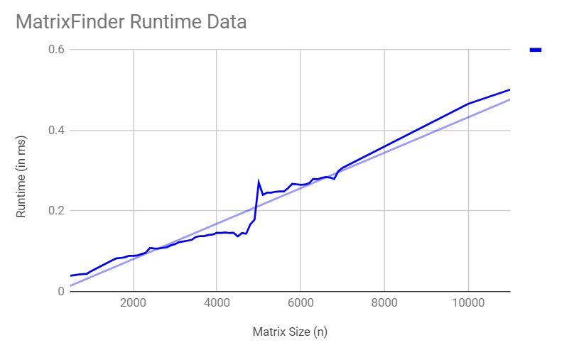

# TripleT

Kyle Tau, Angela Tom, Simon Tsui
APCS2 pd2
Lab 00 -- But What Does the Data Say?
2018-02-09

# Hypothesis
Our method achieves O(n) runtime by searching from the top right to the bottom left.

# Background
The matrixSearch starts off at the top right corner. At this starting point, the orientation is clear: if the target is greater than the current number, go down, and if the target is less than the current number, go left. 

# Experimental Methodology
(At first, when we were deciding on our experiment, we were going to do 10 trials for each size. After comparing this to the data size of other teams, we saw that we needed a bigger range and more trials)

We will test the runtime of sizes ranging from 500 to 7000, going up in increments of 100.
We also tested 10000 and 11000 to see a larger data range.
For each size we will run 100,000 tests and find the average (in milliseconds) of the 100,000 trials.
After graphing the values, with matrix size on the horizontal axis and runtime on the vertical axis, we will evaluate if our method does achieve O(n) runtime. 
Each trial will be searching for the same value but throughout the different sizes we will increase the value as the size increases. In our experiment, we searched for the value 101 in each case.

# Results

# Conclusions
As we increase the size of the matrix, the runtime does increase. When we saw the line of best fit, we saw it as a straight line that sloped upwards, which meant that our algorithm **did run in O(n) time**. There were outliers when n = 4500 and n = 5000, but this didn't affect our data too much. 

Our hypothesis proved to be correct. :)
